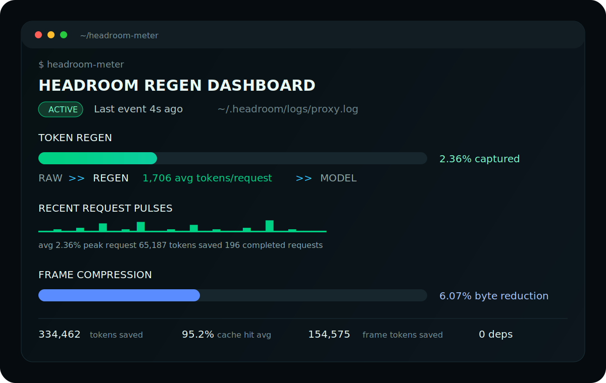

<p align="center">
  
</p>

<h1 align="center">headroom-meter</h1>

<p align="center">
  <strong>Make Headroom compression visible.</strong><br>
  A live terminal dashboard for teams that want proof their agent context is being recovered, compressed, and reused.
</p>

<p align="center">
  <a href="https://github.com/RonnieTheTester/headroom-meter/actions/workflows/ci.yml"></a>
  
  
  <a href="LICENSE"></a>
</p>

---

## The Pitch

LLM agents burn context quietly. Headroom compresses that context, but the work is
mostly invisible unless you read proxy logs. `headroom-meter` turns those logs
into an executive-readable dashboard: token savings, compression spikes, cache
hits, frame reduction, and active transforms, all updating live in your terminal.

It is the hybrid-car regen meter for AI context.

The new speedometer shows the latest completed request in real time. The
odometer beside it shows the cumulative tokens recovered during the session.

## Field Reading

Example measurement from one local Codex + Headroom session on June 24, 2026:

| Signal | Reading |
| --- | ---: |
| Completed requests | 196 |
| Input tokens before Headroom | 14,180,388 |
| Input tokens after Headroom | 13,845,926 |
| Tokens saved | 334,462 |
| Average saved per request | 1,706 |
| Peak single-request save | 65,187 |
| Average cache hit rate | 95.2% |
| WebSocket frame tokens saved | 154,575 |
| Frame byte reduction | 6.07% |

These numbers are a field reading from a real local `proxy.log`, not a universal
benchmark. Your savings depend on workflow, model, context shape, and Headroom
configuration.

## Why Teams Care

- **See ROI while work is happening.** A live meter makes compression tangible.
- **Get an instant current reading.** The speedometer answers, "how much did the last request save?"
- **Debug context-heavy agent sessions.** Spikes and flatlines are visible at a glance.
- **Explain Headroom to non-operators.** The dashboard is easier to understand than `tok_before=...`.
- **Keep the stack lightweight.** One Python script, no packages, no daemon, no telemetry.

## Install

Fast install from GitHub:

```bash
mkdir -p ~/.local/bin
curl -fsSL https://raw.githubusercontent.com/RonnieTheTester/headroom-meter/main/bin/headroom-meter -o ~/.local/bin/headroom-meter
chmod +x ~/.local/bin/headroom-meter
```

Or clone it:

```bash
git clone https://github.com/RonnieTheTester/headroom-meter.git
cd headroom-meter
./install.sh
```

Make sure `~/.local/bin` is on your `PATH`.

## Usage

Start the live dashboard:

```bash
headroom-meter
```

Live mode uses your terminal's alternate screen, so it stays pinned in place
instead of filling your scrollback.

Start counting from zero instead of aggregating the existing log:

```bash
headroom-meter --live-only
```

Print one snapshot and exit:

```bash
headroom-meter --once
```

Make the bars more sensitive:

```bash
headroom-meter --scale 10
```

Force color output, useful for terminal recordings:

```bash
headroom-meter --color always
```

Use ASCII-only graphs:

```bash
headroom-meter --ascii
```

Disable alternate-screen mode if you explicitly want scrollback output:

```bash
headroom-meter --no-alt-screen
```

Use a custom Headroom log path:

```bash
headroom-meter --log /path/to/proxy.log
```

Check the installed version:

```bash
headroom-meter --version
```

## What It Measures

By default, `headroom-meter` tails:

```text
~/.headroom/logs/proxy.log
```

It parses Headroom fields such as:

```text
tok_before=60229 tok_after=57678 tok_saved=2551 cache_hit_pct=98
```

Then it turns them into:

- token regen gauge
- live savings speedometer
- cumulative token odometer
- recent request pulse graph
- frame compression graph
- cache battery
- optimization timing
- active transform list
- TOIN pattern/compression activity

The script is read-only. It does not modify Headroom config or send data anywhere.

## How The Technology Fits

`headroom-meter` does not perform compression. It instruments Headroom's
compression logs and makes the effect legible.

The underlying idea is well studied: long prompts increase memory, latency, and
cost, while prompt/context compression attempts to remove redundancy without
removing the information the model needs. Relevant work includes:

- [Selective Context](https://arxiv.org/abs/2310.06201), which reports lower memory and inference time by pruning redundant context.
- [LLMLingua](https://arxiv.org/abs/2310.05736), a coarse-to-fine prompt compression approach.
- [LLMLingua-2](https://arxiv.org/abs/2403.12968), which frames prompt compression as faithful token classification.
- [Prompt Compression for Large Language Models: A Survey](https://arxiv.org/abs/2410.12388), a broader map of hard and soft prompt compression methods.
- [Lost in the Middle](https://arxiv.org/abs/2307.03172), a reminder that longer context is not automatically better-used context.

Read the technical note: [docs/technology.md](docs/technology.md).

## Requirements

- Python 3.10+
- A running Headroom proxy writing `~/.headroom/logs/proxy.log`
- A terminal that supports ANSI escape codes

No Python packages are required.

## Development

Run checks:

```bash
python3 -m py_compile bin/headroom-meter
bin/headroom-meter --once --color never --ascii
```

Run the local installer:

```bash
./install.sh
```

## Roadmap

- compact mode for narrow terminals
- optional exportable session summary
- better synthetic fixture tests
- terminal recording for the README

## Star It

If this makes Headroom feel easier to understand, star the repo so other Codex
and Headroom users can find it.

## License

MIT
